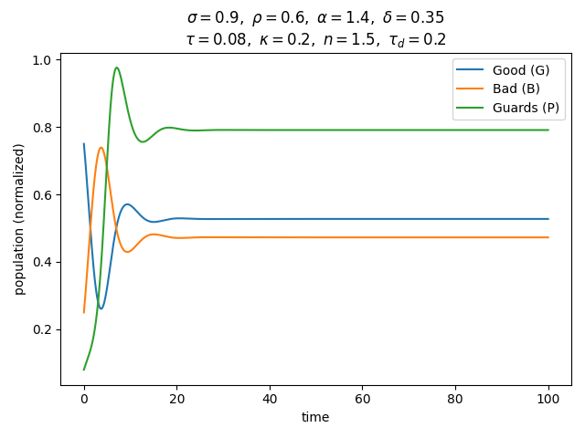
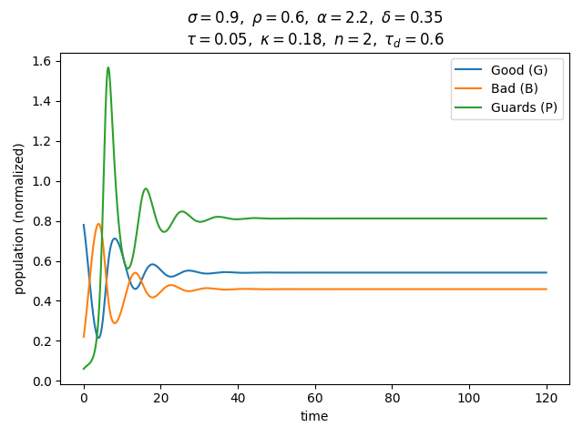
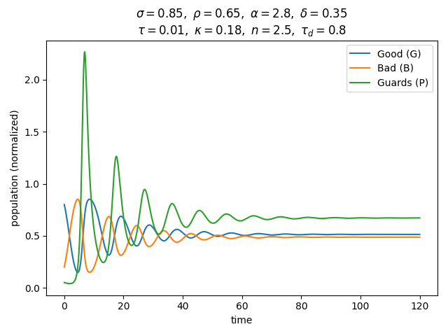
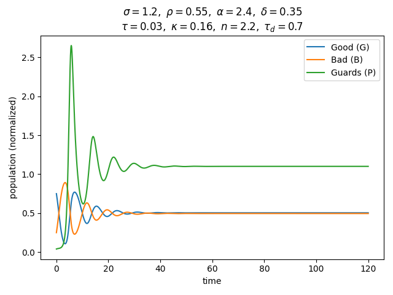
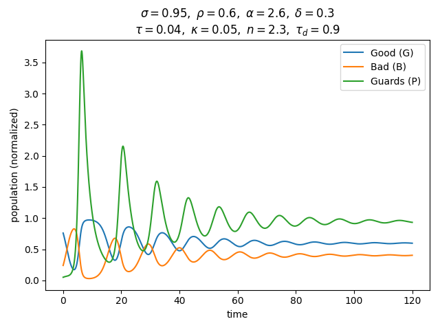
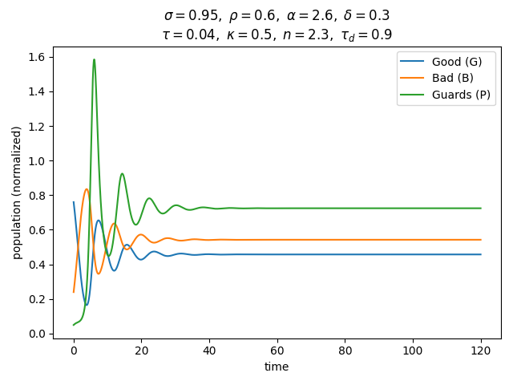
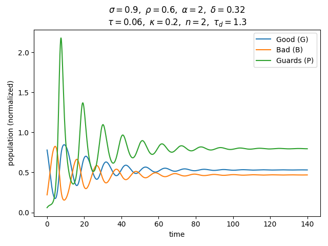
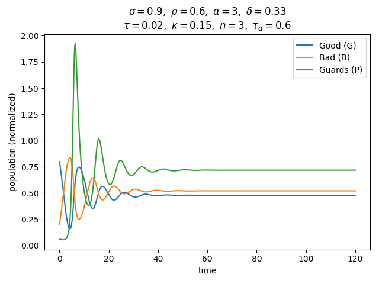
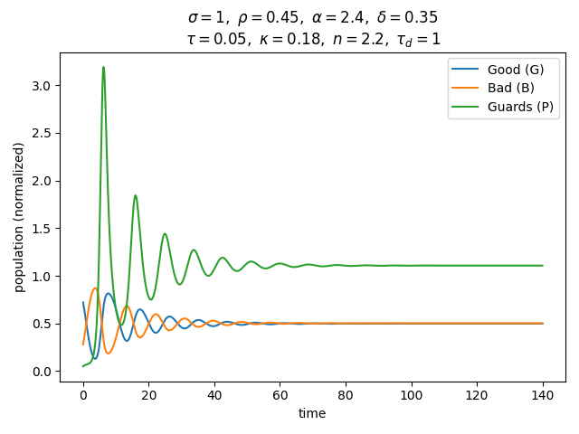
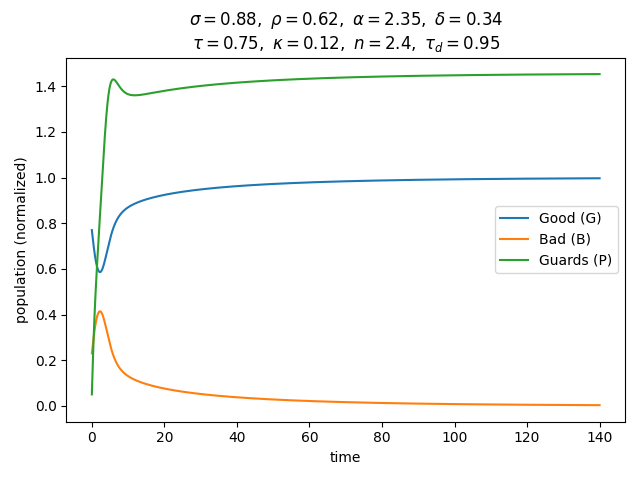

## Good - Evil model

Model jest oparty na równaniach rozniczkowych opisujących zalezności między trzema populacjami jako funkcje czasu $G(t), B(t), P(t)$ czyli odpowiednio **dobrzi, źli i straznicy**. Relacje między nimi są zamodelowane następująco:

$$
\dot{G} = -\sigma GB + \rho PB, \\
\dot{B} = \sigma GB - \rho PB, \\
\dot{P} = \Big(\alpha (B_{\text{delayed}})^n - \delta \Big)P + \tau G - \kappa P^2, \\
B_{\text{delayed}} = B(t - \tau_D)
$$

gdzie parametry oznaczają:

- $\sigma$ - zamiana $G$ -> $B$.
- $\rho$ - zamiana $B$ -> $G$ (kontakt $B$ z $P$).
- $\alpha$ - reakcja $P$ na $B$, $\delta$ - dezercja $P$.
- $\kappa$ - saturacja $P$, spowalnia niekontrolowany wzrost $P$.
- $\tau$ - wzrost liczby $P$ proporcjonalny do $G$.
- $B_{\text{delayed}}$ - opoźniona reakcja $P$ na $B$, samplujemy wartości $B$ sprzed czasu $\tau_D$.

Kilka wykresów:

Rozwiązując równanie na wyeliminowanie zła dostajemy warunek:

$$
    \tau > \delta \frac{\sigma}{\rho} + \kappa \Big( \frac{\sigma}{\rho} \Big)^2.
$$

Wstawiąjąc faktyczne dane oraz ustawiąjąc odpowiednie $\tau$, ponizszy wykres potwierdza, ze mozemy zredukować $B$ do zera.

