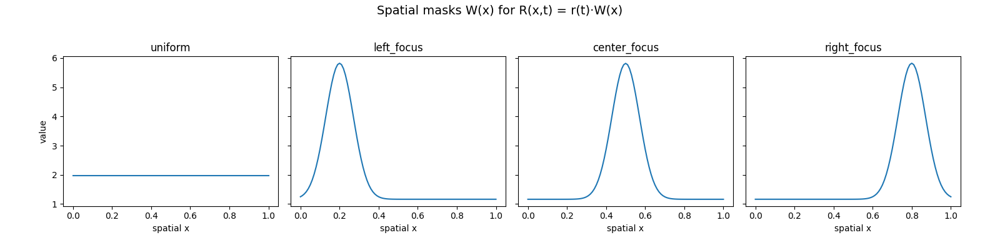
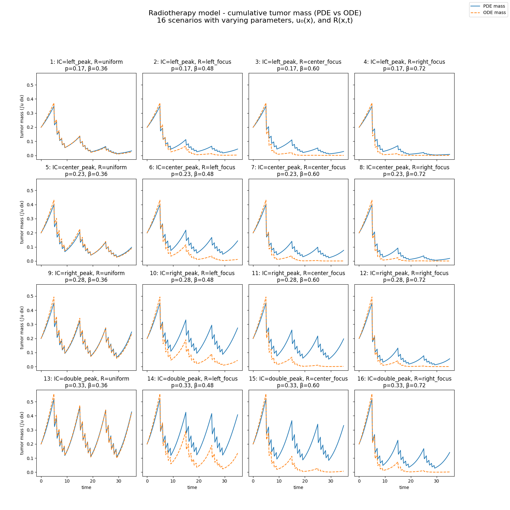

## Lab 2 - Surrogate ODE + Trainable NN

### Baseline model

Radiotherapy – a model of hypoxia and the radiation effect. Baseline model:

$$
    \frac{\partial u(x, t)}{\partial t} = D \nabla^2 u + \rho u(1 - \frac{u}{K}) -
\beta R(x, t) H(x) u,
$$

where:

- $R(x, t)$ - radiation dose distribution.
- $H(x)$ - hypoxia function.
- $\beta$ - radiosensitivity coefficient (sensitivity to radiation).
- $u$ - tumor cell density function, normalized to $K=1$.

### Surrogate model

Now let's define surrogate model. For simplicity of the comparison we will use one dimensional model. We can define spatial average tumor density:

$$
    U(t) = \frac{1}{L} \int_0^L u(x, t) \text{d}x.
$$

We can interate PDE over the spatial dimension and use several simplification to achieve much less complex equation:

- Set the boudary conditions to zero, the spatial average of $\frac{\partial^2 u}{\partial x^2} = 0$.
- $u(1-u)$ can be approximated by $U(1-U)$.
- $R(x, t) H(x) u$ can be approximated by some $r(t)H_{\text{eff}}\cdot U$.

The $H_{\text{eff}}$ is the average hypoxia defined as $H_{\text{eff}} = \frac{1}{L} \int_0^L H(x) \text{d}x$. Given these assumptions, a natural surrogate ODE for the mean density is:

$$
    \frac{\text{d}U}{\text{d}t} = \rho U(1-U) - \beta H_{\text{eff}} r(t) U.
$$

We need to calculate the initial condition for the ODE model as $U(0) = \frac{1}{L} \int_0^L u_0(x) \text{d}x$.

### Numerical comparison

For the PDE, we used:

- 1D finite differences with zeros at the boundary.
- Explicit Euler method.
- Number of points $N=101$, $\delta t = 0.01$ and $T_{\text{end}} = 35$.

For thee surrogate ODE, we used:

- Explicit Euler for the same $\delta t$.
- Same radiation schedule as for PDE.

Parameters used for the first simulation:

- $L = 1$,
- $D = 0.001$,
- $\rho = 0.3$,
- $\beta = 0.8$,
- $u_0(x) = 0.2$ - uniform on entire $L$,
- hypoxia profile $H(x) = 0.4 + 0.6 \exp(-(x - 0.5L)^2)$ - better oxygenation around $x = 0.5L$,
- Uniform radiation $R(x, t) = r(t)$.

Running this simulation produces following plots:

### More simulations

As we can see for this one simulation, the surrogate model approximates our function incredibly well. Lets generate a grid of different parameters and check if it works as well for every trial. First we generate different sets of $u_0(x)$ and a set of spatial radiation masks $R(x)$. We focues on the fact that across experiments the spatial integral of both variables should be constant.

Using these initial conditions and by varying $\beta$ and $\rho$ we produced this grid of ODE vs PDE comparisons, which let's use explore the comparison between both equation types.

As we can see, when we use uniform radiation mask, the ODE is very accurate when compared to PDE. When it comes to other distributions, we can see that most accurate simulations are seen when the radiation mask peak aligns with the peak density of cancer cells.

### Training Neural Network

We have decided to use NN as a learned time-stepper. The task of the neural network will be to approximate the value of surrogate function $U$ from the previous value of $U$ and the parameters of the simulation. The approximated function can be defined as:

$$
    F_\theta: (U_n, r_n, \Delta t, \rho, \beta, ...) \rightarrow U_{n+1}
$$

We will use ODE and sample many trajectoties. For the MLP we chose very simple architecture:

- Input - 5 parameters
- Hidden Layer - 32 neurons
- Output - 1 scalar value

To check how the model predicts the future, we will train the model on the time interval from $0$ to $20$, and when testing, we will also prompt the model on the entire interval we used in previous experiments, that is $(0, 35)$. We generated 200 random trajectories, on which the model will be trained. After training for few minutes we made one simulation using both PDE and ODE and one using purely surogate NN model. Here is the plot:

### Summary

We see that the neural network can be used for the approximation, but falls behind when compared to directly solving differential equations. Maybe the accuracy could be improved by using more complex netoworks (ie. CNNs) and also approximating the values in the spatial dimension:

$$
    \Big(u_n(x_1), u_n(x_2), ..., u_n(x_m), r_n, \Delta t, \rho, \beta, ...\Big) \rightarrow u_{n+1}(x_i),
$$

instead of the current $U_n \rightarrow U_{n+1}$ approximation.

