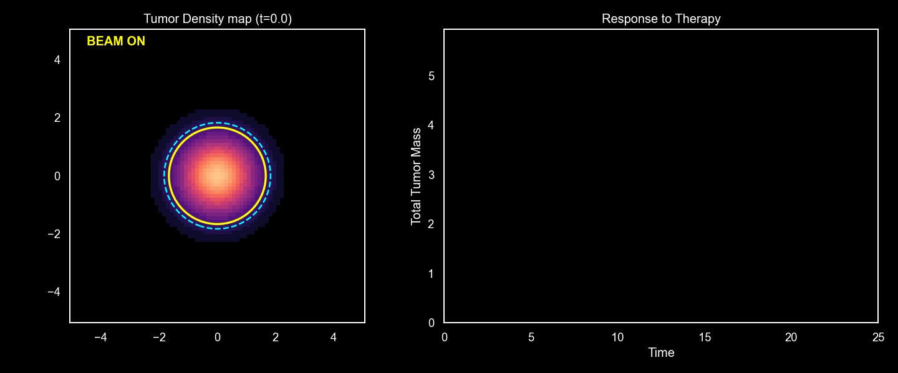
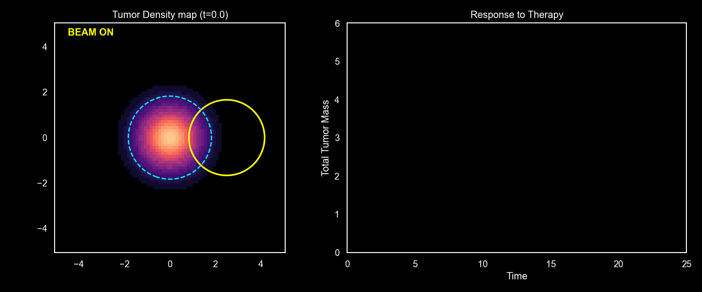
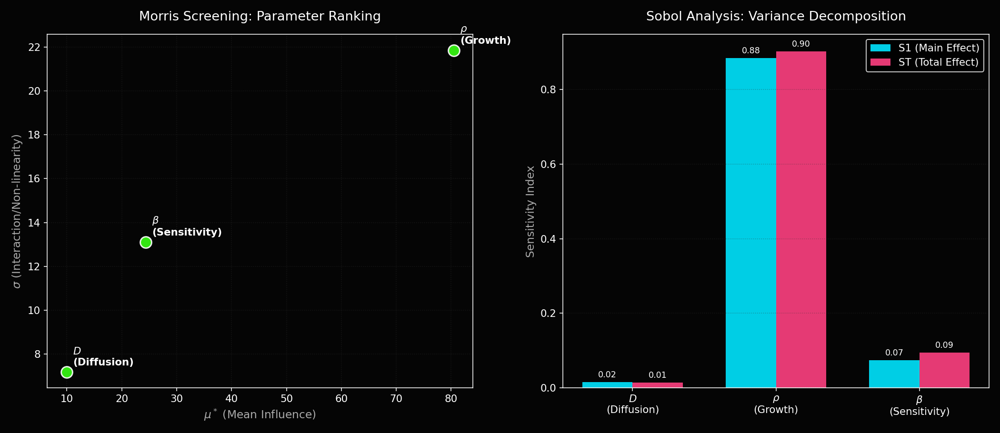
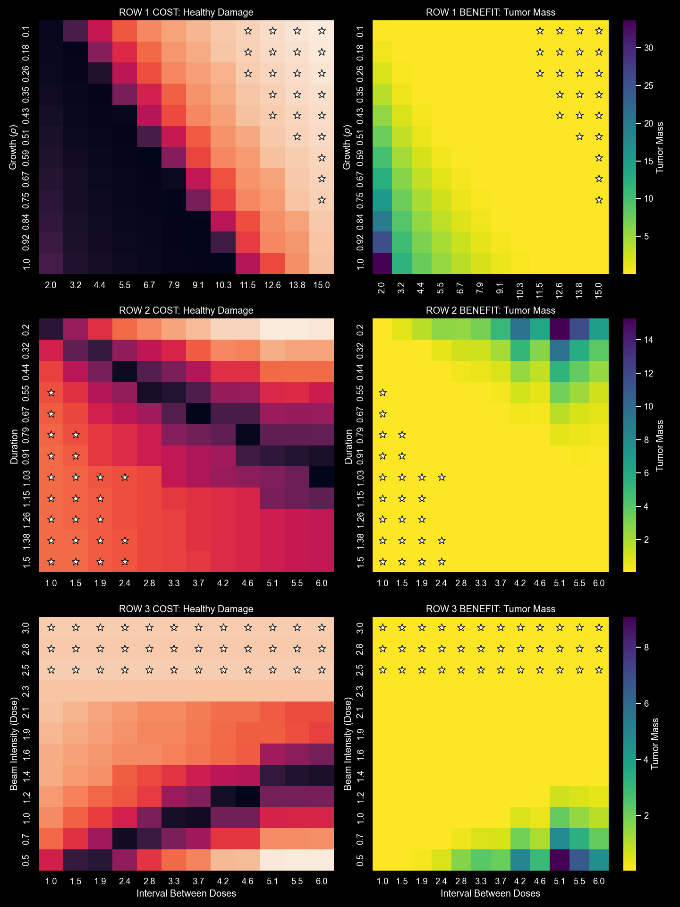
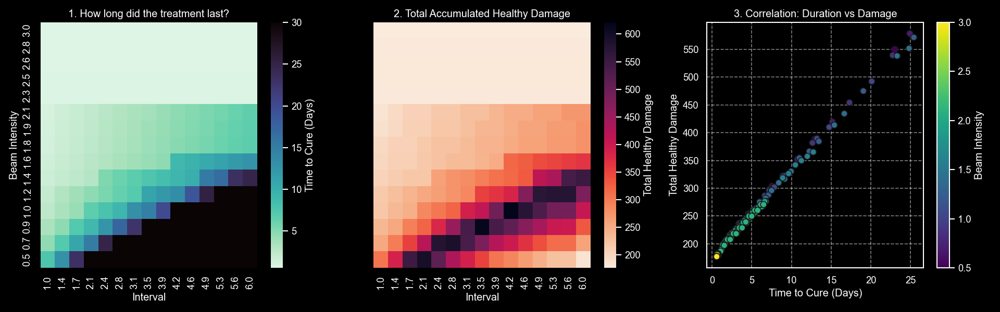
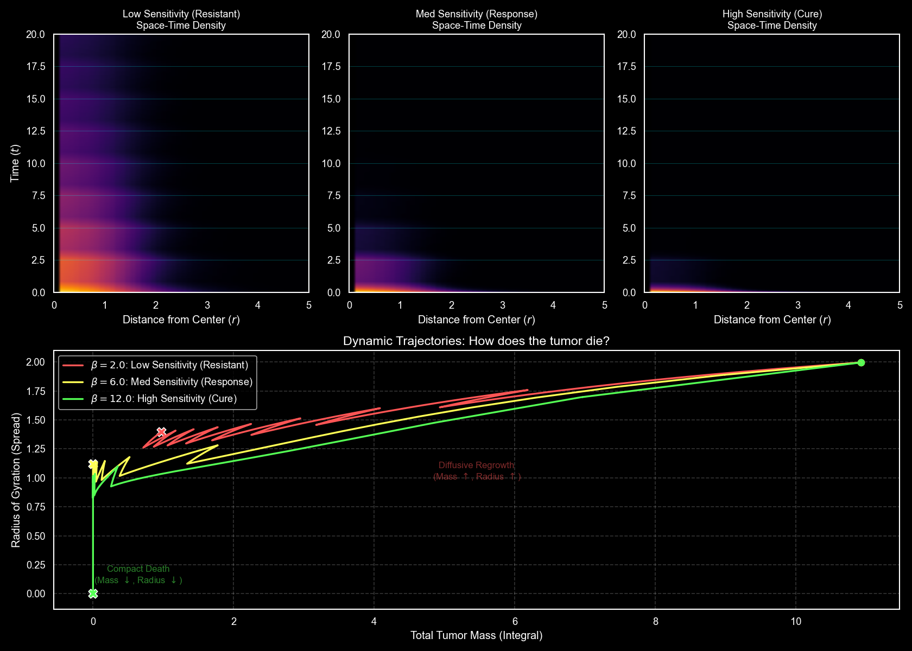

## Sensitivity Analysis

### Baseline model

Radiotherapy – a model of hypoxia and the radiation effect. Baseline model:

$$
    \frac{\partial u(x, y, t)}{\partial t} = D \nabla^2 u + \rho u(1 - \frac{u}{K}) - \beta R(x, y, t) H(x, y) u,
$$

where:

- $R(x, y, t)$ - radiation dose distribution.
- $H(x, y)$ - hypoxia function.
- $\beta$ - radiosensitivity coefficient (sensitivity to radiation).
- $u(x, y, t)$ - tumor cell density function in two dimensions as a function of time, normalized to $K=1$.

### Sample simulation

We performed 2D simulations in full spatial and temporal domains. Below are examples of the given simulations.

### Sensitivity Analysis

First analysis was performed using Morris and Sobol method.

We see that the diffusion coeffiecient has little influence on the final outcome. Expectedly, $\rho$ - the regenaration speed of the tumor was the most influential parameter.

We decided to investigate model behavior by performing a grid search over the parameter space in the form of 2D heatmaps, where the value at point $(x, y)$ represents the cumulative mass of the tumor at the end of the simulation. We also defined a secondary metric called **damage to healthy cells**. By "healthy cells," we mean points where the value of $u$ is close to $0$. We defined it as follows:

$$
    D_\text{healthy} = \int_{0}^{T_{cure}} \left[ \iint_{\Omega} \underbrace{(1 - u(x,y,t))}_{\text{Healthy Fraction}} \cdot \underbrace{R(x,y,t)}_{\text{Radiation}} \, dA \right] dt
$$

We plotted heatmaps for the following pairs of parameters:

- $\rho \in (0.1, 1.0)$ VS $\beta \in (2.0, 12.0)$.
- duration $\in (0.2, 1.5)$ VS dose interval $\in (1.0, 6.0)$.

On the left plot, we visualize the cumulative damage to healthy tissue, and on the right, the final tumor mass after treatment. We marked with stars the states that achieved a final tumor mass $< 0.05$, sorted by the lowest damage to healthy cells. It is worth noting that we simulate the treatment only until the patient is cured (adaptive therapy); we do not continue irradiation after the mass reaches a negligible number.

We can see the expected outcome in the first row. When radiosensitivity ($\beta$) is high and cancer cells regenerate slowly ($\rho$), we manage to eliminate the entire tumor easily without significantly damaging healthy cells. In the second and third rows, we observe that treating for shorter periods but with higher intensity or frequency yields better results. This suggests that eliminating the cancer quickly is less invasive for the patient in the long run.

We can also plot the correlation between the time to cure and the total damage accumulated.

The second experiment we conducted involved cumulative plots of radial tumor densities (Hovmöller diagrams) and mass trajectories. In the first row of plots, we visualize the average value of tumor density at distance $r$ from the center. The $y$-axis represents the time of treatment. In the bottom plot, we visualize the spread (radius of gyration) vs. tumor mass as a trajectory in the time dimension.

We see that given a constant dose but low sensitivity, it was impossible to kill the tumor.

### Summary

Key points derived from the analysis include:

- **The Efficiency-Toxicity Correlation:** There is a strong positive correlation between the duration of the treatment and the damage caused to healthy tissue. Protocols that eliminate the tumor quickly (high sensitivity or high intensity) result in lower cumulative toxicity because the treatment can be stopped earlier.
- **Hypofractionation Advantage:** The analysis suggests an advantage for "Hypofractionation" (high dose, fewer fractions). High-intensity beams combined with optimized intervals allow for tumor eradication with less total exposure to healthy tissue compared to low-intensity, prolonged treatments.
- **The "Safety" of Aggression:** Contrary to intuition, a more aggressive treatment parameter (higher $\beta$) is safer for the patient in this adaptive model. Low $\beta$ treatments fail to overcome the proliferation rate ($\rho$), leading to indefinite treatment cycles and maximum healthy tissue damage.
- **Structural Collapse vs. Diffusive Regrowth:** The phase space analysis reveals two distinct trajectories. Successful treatments show a "Compact Death" where mass and radius decrease simultaneously. Failed treatments exhibit "Diffusive Regrowth," where the tumor mass may fluctuate, but the radius (spread) continues to increase or stabilizes at a high value.
- **Hypoxia Shielding:** The space-time diagrams confirm that the tumor center (necrotic core) is the most resistant region. In marginal cases, the tumor dies from the "outside-in," with the hypoxic core persisting long after the oxygenated rim has been eradicated.
